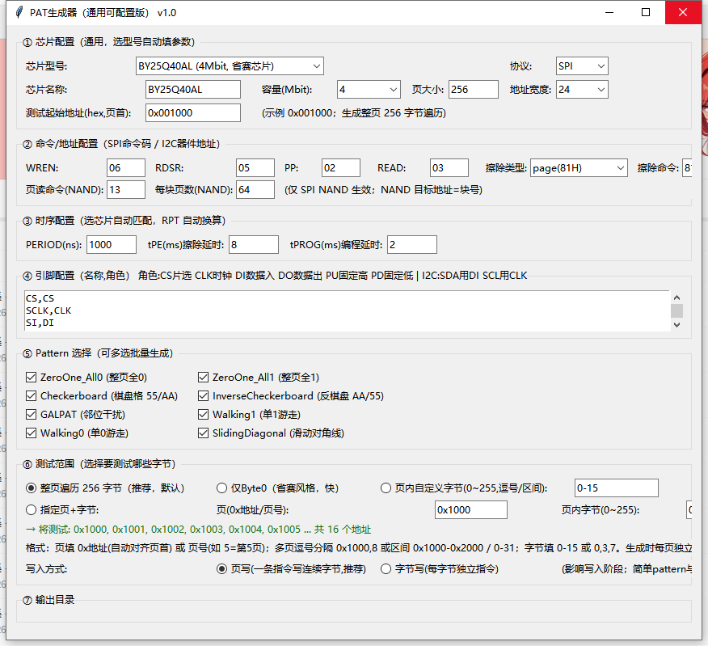

# PAT_Gen · 存储芯片测试 PAT 生成器

**给存储芯片测试机用的 `.pat` 向量文件生成器。** 界面上填好芯片参数（容量、命令码、引脚、时序），它批量生成「擦除 → 写入 → 回读校验」的完整测试向量，直接拿去测试机上机。

目标平台：胜达克测试机（`.pat` 文本向量格式）。



---

## 为什么需要它

手写 `.pat` 极其枯燥：一条 SPI 指令 = 8 个时钟周期 = 8 行向量，一个 24 位地址再来 24 行，一整页 256 字节写下来就是几千行；中途改一个命令码，所有注释还得跟着手改。

PAT_Gen 把这些规则固化成模板：**改配置 → 点生成**，几千行向量几秒钟出来，注释和命令码自动联动。

## 30 秒上手

1. 下载 [`PAT_Gen.exe`](PAT_Gen.exe)（Windows 单文件，免安装，约 11 MB）
2. 双击运行，在 **① 芯片型号** 里选型号 —— 容量、页大小、命令码、时序、引脚全部自动填好
3. 在 **⑤ Pattern 选择** 里勾选要生成的图案（可多选）
4. **⑦ 输出目录** 选个文件夹 → 点 **批量生成 PAT 文件**

结果：每个勾选的 Pattern 输出一个独立 `.pat` 文件。

## 支持范围

| 项目 | 支持情况 |
| --- | --- |
| 协议 | SPI NOR Flash、I2C EEPROM、SPI NAND |
| 内置芯片 | 31 款 + 「自定义」（BY25Q40AL、W25Q16/32/64/128JV、GD25Q64C、MX25L12835F、IS25LP128、S25FL128S、EN25QH128；AT24C01~256、24LC02/16/256、M24C02/16/64、GT24C02/16、PY24C02、FM24C02；W25N01GV、GD5F1GQ5RE） |
| Pattern | 8 种，可多选批量生成 |
| 擦除类型 | page `81H` / sector `20H` / block32 `52H` / block `D8H` / 自定义 |
| 输出 | UTF-8 纯文本 `.pat` |

## 8 种 Pattern

| 名称 | 图案 | 用途 |
| --- | --- | --- |
| `ZeroOne_All0` | 整页 `00H` | 基础全写 0 |
| `ZeroOne_All1` | 整页 `FFH` | 基础全写 1 |
| `Checkerboard` | `55H` / `AAH` 交替 | 相邻位交叉干扰 |
| `InverseCheckerboard` | `AAH` / `55H` 交替 | 反相棋盘格 |
| `GALPAT` | 背景 `00H`/`FFH` + BC 单元写反码 | 位线/字线耦合、邻位干扰定位 |
| `Walking1` | `01→02→04→…→80` 逐位游走 | 单位 stuck-at 故障 |
| `Walking0` | `FE→FD→FB→…→7F` 逐位游走 | 反相单位游走 |
| `SlidingDiagonal` | 8 字节滑动对角线整页重复 | 行列耦合 |

NOR Flash 每轮掩码前自动插入「整页擦除 + 校验全 `FF`」；I2C EEPROM 无擦除步骤，直接重写。

## 生成的 `.pat` 长什么样

```
HEAD[PIN_NAME]:
CS,
SCLK,
SI,
SO,
WP,
HOLD,
END_HEAD;

@@PATTERN_DEFINE
                    // CS,SCLK,SI,SO,WP,HOLD; Pattern:Checkerboard Addr=0x001000 Erase+Write Standard Flow
start:              100X11; AC_SET 1;   //    START
                    100X11;
                    100X11;//================ STAGE 1: ERASE ADDR=0x001000 ================
                    0C0X11;//06H WREN start
                    0C1X11;
                    0C0X11;//06H WREN end
                    0C0X11;//05H RDSR verify WEL bit6=1
                    ...
```

**向量格式**：每行 6 个字符，顺序就是引脚表顺序 `CS,SCLK,SI,SO,WP,HOLD`。

| 字符 | 含义 |
| --- | --- |
| `0` / `1` | 驱动低 / 高 |
| `C` | 时钟采样沿 |
| `X` | 不关心 / 释放总线 |
| `H` / `L` | 读回比较，期望高 / 期望低 |

文件结构：`HEAD[PIN_NAME]: ... END_HEAD;` 声明引脚 → `@@PATTERN_DEFINE` 到 `@@END_PATTERN_DEFINE` 之间是向量主体，`start:` / `end:` 为入口出口标签。
擦除和编程的等待用 `RPT` 重复周期实现，`RPT × PERIOD = 实际等待时间`，工具会按你填的 `tPE` / `tPROG` / `tWR` 自动换算行数。

完整可上机样例：[`sample.pat`](sample.pat)（BY25Q40AL，`Checkerboard`，地址 `0x001000`，整页 256 字节，6445 行）。

## 界面配置项

| 分区 | 内容 |
| --- | --- |
| ① 芯片配置 | 芯片型号 / 协议 / 名称 / 容量 / 页大小 / 地址宽度 / 测试起始地址 |
| ② 命令与地址 | SPI：`WREN` `RDSR` `PP` `READ`、NAND 页读命令与每块页数；I2C：7 位器件地址、字地址宽度（8=24C01/02，16=24C04 及以上） |
| ③ 时序 | `PERIOD(ns)`、`tPE` 擦除延时、`tPROG` 编程延时、`tWR` 写周期 |
| ④ 引脚 | 每行 `引脚名,角色`；角色 `CS` 片选 / `CLK` 时钟 / `DI` 数据入 / `DO` 数据出 / `PU` 固定高 / `PD` 固定低（I2C：SDA 用 `DI`，SCL 用 `CLK`） |
| ⑤ Pattern | 8 种多选 |
| ⑥ 测试范围 | 整页遍历 / 仅 Byte0 / 页内自定义字节 / 指定页+字节；写入方式 页写或字节写 |
| ⑦ 输出目录 | 选择保存文件夹，默认当前目录 |

**测试范围写法**：页可填 `0x` 十六进制地址（自动对齐页首）或十进制页号（`5` = 第 5 页）；支持逗号分隔与区间，如 `0x1000,8` 或 `0x1000-0x2000`、`0-31`；页内字节填 `0-15` 或 `0,3,7`。指定页+字节时，界面会实时预览将要测试的绝对地址。多页场景下每页独立执行 擦除 → 写 → 校验。

## 已知限制

- `GALPAT` 暂不支持 SPI NAND（NAND 按块擦除，BC 反码开销过大，建议改用 `ZeroOne` / `Checkerboard` / `Walking`）
- 仅 Windows；未做代码签名，首次运行可能被 SmartScreen 拦截，点「仍要运行」即可
- 时序与命令码由使用者按数据手册负责，工具只做地址越界等参数校验，不做电气校验
- 生成前请核对引脚表与测试机实际通道一致

## 版本

v1.0 · 本仓库发布编译好的单文件可执行程序，不含 Python 源码。
